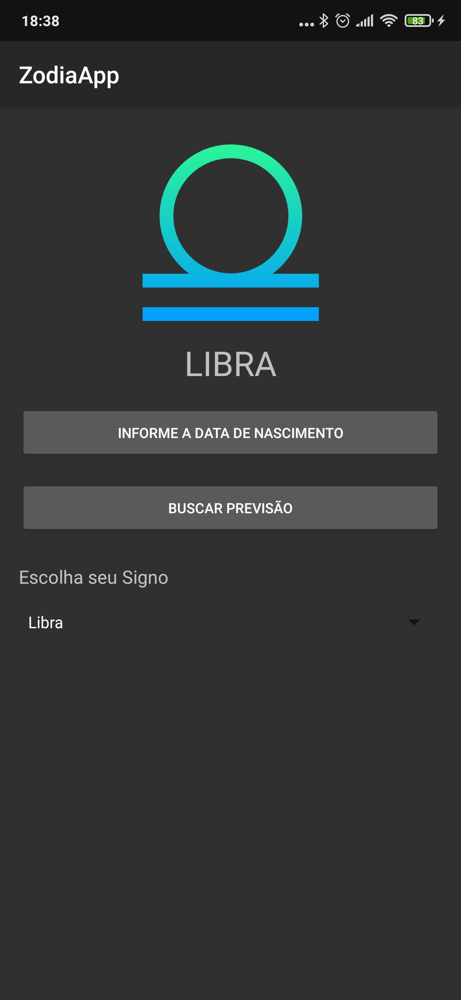

# App ZodiaApp

O ZodiaApp faz buscar de preivisão de horoscopo consumindo uma API publica de Horoscopo.
Pode-se selecionar o signo em uma lista e caso o usuário não saiba seu signo, com base em sua data de nascimento é possivel defini-lo.

## Step by Step

### 1. Adicione as dependias externas
No arquivo build.gradle(App) adicione as dependencias no bloco `dependencies`.

```javascript
    // Calculo de periodos
    implementation 'org.threeten:threeten-extra:1.5.0'
    // Requisicoes Web
    implementation 'com.android.volley:volley:1.1.1'
    // Manipulação de JSON
    implementation 'com.fasterxml.jackson.core:jackson-databind:2.11.2'

``` 

### 2. Conhecendo a API de Horoscopo

Acesse o link [API Horoscopo](https://github.com/andrechavesg/babi-api-horoscopo) para conhece-la e verificar os **end-points** (links de acesso para recursos) possiveis de acesso a API.
Iremos utilizar o end-point `babi.hefesto.io/signo/{signo}/dia`; mas fique a vontade para explorar os demais end-points.
Utilizaremos os Frameworks Volley e Jackson para consumir os dados desta API.

#### Exemplo de dados recebidos pela API

```javascript
{
  "signo": "aries",
  "texto": "        A semana começa intensa e produtiva. Finanças pedem sua atenção e cuidado, além de influenciarem seu humor. Mercúrio e Marte advertem: há risco de discussões tão agressivas quanto insignificantes. Pratique seu autocontrole.       Saiba mais sobre saúde, bem-estar, amor, relacionamento, trabalho e dinheiro do seu signo na previsão mensal de Áries de Barbara Abramo.Perfil da mulher de Áries   Ser uma mulher de Áries é ter pulso firme, pensamentos diretos e muita iniciativa. Muitas vezes isso pode ser confundido com falta de simpatia, mas na verdade as mulheres deste signo sabem muito bem o alvo que querem acertar.No amor e no sexoA mulher ariana costuma ser bem decidida no amor. Além de assumir todos seus desejos e ambições em uma relação, não se deixa levar pela opinião de seu par. Por ser regida pelo elemento fogo, tem no sexo uma grande expressão de sua natureza e, caso a outra parte da relação não corresponda a essa chama, pode se sentir desestimulada a continuar no relacionamento. Precisa tomar cuidado com a impulsividade para não ferir ninguém ou se arrepender de alguma ação inconsequente.No trabalho e no dinheiroÁries é um signo de luta. Portanto, mulheres deste signo lutam por seu lugar ao sol e se esforçam para alcançar posições melhores sempre. Conviver com uma ariana no trabalho pode ser um pouco difícil, já que ela vai defender suas ideias e estratégias com unhas e dentes. O lado positivo é que há força de vontade para mobilizar equipes, chefias e fazer acontecer os projetos mais complexos. Gostam de ganhar dinheiro, mas também gostam de gastar. Mais uma vez é preciso tomar cuidado com a impulsividade e os desejos.Na família e na amizadeMulheres de Áries gostam de liberdade. Quando são mais novas, podem ser a pessoa menos presente nos momentos em família, preferindo viajar ou descobrir novas coisas. Porém, é quem vai estar nos momentos mais difíceis e se colocar à frente de qualquer situação desafiadora, buscando resolver os conflitos externos sem que ninguém precise se preocupar com detalhes. Precisou de ajuda? Pode deixar que a ariana resolve! Uma mãe ariana costuma dar muitas broncas e pode ser interpretada — pelos outros — como dura. Porém, proporciona o sentimento de confiança e determinação em seus filhos.   ",
  "autor": "Barbara Abramo",
  "urlOrigem": "https://universa.uol.com.br/horoscopo/aries/horoscopo-do-dia/",
  "dataAcesso": {
    "date": "2020-09-21 13:02:20.502510",
    "timezone_type": 3,
    "timezone": "America/Sao_Paulo"
  }
}
```

### 3. Crie as Model Classes
O Jackson Framework realiza conversões de JSON para classes Java/Kotlin assim como converte classes Java/Kotlin em JSON.
Com base nas data classes de Kotlin, crie as classes que representarão os dados recebidos em JSON da API.

Crie o arquivo `\model\Previsao.kt` e adicione o código abaixo.

```javascript
@JsonIgnoreProperties(ignoreUnknown = true)
data class Previsao(var signo: String, var texto: String, var autor: String, var urlOrigem: String,
                    var dataAcesso: DataAcesso)

data class DataAcesso(var date: String, var timezone_type: String, var timezone: String)

```

### 4. Crie a interface gráfica.

Siga este mockup e crie a interface gráfica para as telas de chamada ao serviço e exibição dos dados recebidos com a previsão.



### 5. Vamos codificar


5.1. Dentro do onCreate() adicione o objeto da classe Volley para criar as requisições.

```javascript
val queue = Volley.newRequestQueue(this)
```

5.2. Agora vamos adicionar os Maps que irão armazenas os intervalos que representarão cada signo.

```javascript
// Zona de horario para definir periodo inicial
        val zoneId = ZoneId.of("America/Sao_Paulo")

        //<editor-fold desc="Intervalo de tempo com base nas datas do Zodiaco" defaultstate="collapsed">
        val intervalos = mapOf<String, Interval>(
            "aries".to(
                Interval.of(
                    LocalDate.of(2020, 3, 21).atStartOfDay(zoneId).toInstant(),
                    LocalDate.of(2020, 4, 20).atStartOfDay(zoneId).toInstant()
                )
            ),

            "touro".to(
                Interval.of(
                    LocalDate.of(2020, 4, 20).atStartOfDay(zoneId).toInstant(),
                    LocalDate.of(2020, 5, 21).atStartOfDay(zoneId).toInstant()
                )
            ),

            "gemeos".to(
                Interval.of(
                    LocalDate.of(2020, 5, 21).atStartOfDay(zoneId).toInstant(),
                    LocalDate.of(2020, 6, 22).atStartOfDay(zoneId).toInstant()
                )
            ),

            "cancer".to(
                Interval.of(
                    LocalDate.of(2020, 6, 22).atStartOfDay(zoneId).toInstant(),
                    LocalDate.of(2020, 7, 23).atStartOfDay(zoneId).toInstant()
                )
            ),

            "leao".to(
                Interval.of(
                    LocalDate.of(2020, 7, 23).atStartOfDay(zoneId).toInstant(),
                    LocalDate.of(2020, 8, 23).atStartOfDay(zoneId).toInstant()
                )
            ),

            "virgem".to(
                Interval.of(
                    LocalDate.of(2020, 8, 23).atStartOfDay(zoneId).toInstant(),
                    LocalDate.of(2020, 9, 23).atStartOfDay(zoneId).toInstant()
                )
            ),

            "libra".to(
                Interval.of(
                    LocalDate.of(2020, 9, 23).atStartOfDay(zoneId).toInstant(),
                    LocalDate.of(2020, 10, 23).atStartOfDay(zoneId).toInstant()
                )
            ),

            "escorpiao".to(
                Interval.of(
                    LocalDate.of(2020, 10, 23).atStartOfDay(zoneId).toInstant(),
                    LocalDate.of(2020, 11, 22).atStartOfDay(zoneId).toInstant()
                )
            ),

            "sagitario".to(
                Interval.of(
                    LocalDate.of(2020, 11, 22).atStartOfDay(zoneId).toInstant(),
                    LocalDate.of(2020, 12, 22).atStartOfDay(zoneId).toInstant()
                )
            ),

            "capricornio".to(
                Interval.of(
                    LocalDate.of(2020, 12, 22).atStartOfDay(zoneId).toInstant(),
                    LocalDate.of(2021, 1, 20).atStartOfDay(zoneId).toInstant()
                )
            ),

            "aquario".to(
                Interval.of(
                    LocalDate.of(2020, 1, 20).atStartOfDay(zoneId).toInstant(),
                    LocalDate.of(2020, 2, 19).atStartOfDay(zoneId).toInstant()
                )
            ),

            "peixes".to(
                Interval.of(
                    LocalDate.of(2020, 2, 19).atStartOfDay(zoneId).toInstant(),
                    LocalDate.of(2020, 3, 21).atStartOfDay(zoneId).toInstant()
                )
            )
        )
        //</editor-fold>        
```

5.3. Crie as funções auxiliares, fora do onCreate() crie as seguintes funções definirSigno() e getPrevisao()

5.3.1. Função definirSigno();

```javascript
/**
     * Funcao que verifica o periodo da data de nascimento do usuario e verifica se o periodo esta contido
     * no intevalo referente aos Signos
     */
    private fun definirSigno(zoneId: ZoneId?, intervalos: Map<String, Interval>) {

        var nascimento = LocalDate.of(date.year, mesNascimento, diaNascimento).atStartOfDay(zoneId).toInstant()

        /**
         * Percorre o intervalo de periodos validando o periodo de nascimento
         */
        intervalos.forEach { k, v ->
            /**
             * Verifica se é o primeiro periodo e altera o ano para para compatibilidade
             */
            if (mesNascimento == 1 && diaNascimento <= 19) {
                nascimento = LocalDate.of(2021, mesNascimento, diaNascimento).atStartOfDay(zoneId).toInstant()
            }

            /**
             * Verifica de o nascimento esta contido no periodo atual da iteração
             */
            if (v.contains(nascimento)) {
                // Obtem nome do recurso
                val resource = resources.getIdentifier(k, "drawable", applicationContext.packageName)
                // Configura a imagem correta do signo
                imageView.setImageResource(resource)
                // Armazena referencia no atributo TAG para ser reutilizado nas demais funções
                imageView.tag = k
                // Seta o signo no TextView
                textViewSigno.text = k.toUpperCase()
                Log.i("SIGNO", k)
            }
        }
    }
```

5.3.2. Função getPrevisao();

```javascript
    /**
     * Funcao que realiza requisição web à API de previsões de horóscopo
     */
    private fun getPrevisao(signo: String, queue: RequestQueue) {
        // Exibir proressbar
        progressBar.visibility = View.VISIBLE
        val url = "http://babi.hefesto.io/signo/$signo/dia"

        /**
         * Uso da biblioteca voley para tratamento das requisições web
         */
        val requestPrevisao = StringRequest(Request.Method.GET, url, {
            val intent = Intent(applicationContext, PrevisaoActivity::class.java)
            intent.putExtra("previsao", it)

            // Ocultar progressbar
            progressBar.visibility = View.INVISIBLE
            startActivity(intent)
        },
            {
                println("Erro: ${it.localizedMessage}")
            })
        queue.add(requestPrevisao)
    }
```

5.4. Adicione a chamada da função getPrevisão() através do botão de previsão no método onCreate().

```javascript
        buttonPrevisao.setOnClickListener {
            getPrevisao(imageView.tag.toString(), queue)
        }
```

5.5. Crie o Listener que sera executado quando o usuario selecionar um signo no spinner (caixa de seleção).

```javascript
spinnerSignos.onItemSelectedListener = object : AdapterView.OnItemSelectedListener{
            override fun onItemSelected(
                parent: AdapterView<*>?,
                view: View?,
                position: Int,
                id: Long) {
                val signo = (view as TextView).text.toString()
                    .toLowerCase(Locale.ROOT)
                val identifier = resources.getIdentifier(signo,"drawable", packageName)
                imageView.setImageResource(identifier)
                imageView.tag = signo
                textViewSigno.text = signo.toUpperCase()
            }

            /**
             * Selecionar a imagem de Áries ao iniciar
             */
            override fun onNothingSelected(parent: AdapterView<*>?) {
                if (parent != null) {
                    parent.setSelection(0)
                }
            }
        }
```

5.6. Crie o DatePickerDialog para capturar a data de nascimento do usuario.

```javascript
        /**
         * Criacao de DatePickerDialog para capturar a data e definir o signo do usuario
         */
        val datePickerListener = object : DatePickerDialog.OnDateSetListener{
            override fun onDateSet(view: DatePicker?, year: Int, month: Int, dayOfMonth: Int) {
                mesNascimento = month.plus(1)
                diaNascimento = dayOfMonth
                definirSigno(zoneId, intervalos)
                Toast.makeText(applicationContext, "Dia: $diaNascimento - Mês: ${mesNascimento}", Toast.LENGTH_LONG).show()
            }
        }

```

5.7. Adicione a chamada de criação de um datePickerDialog ao botão de captura de data de nascimento.

```javascript
        /**
         * Chamada do DatePickerDialog
         */
        buttonDataNascimento.setOnClickListener {
            DatePickerDialog(this, datePickerListener, date.year, date.month.value - 1, date.dayOfMonth).show()
        }
```

# Terminamos!


"# zodiacApp" 
